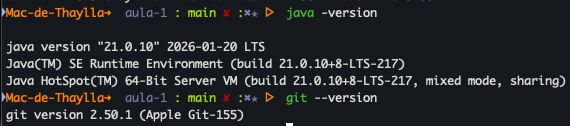
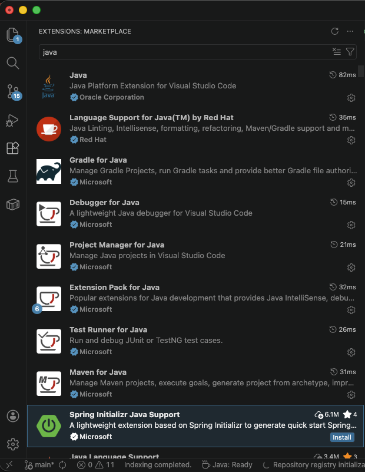
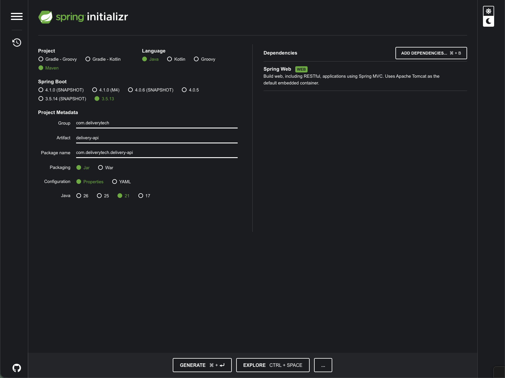
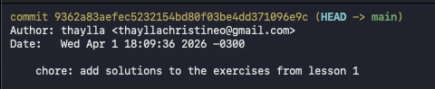
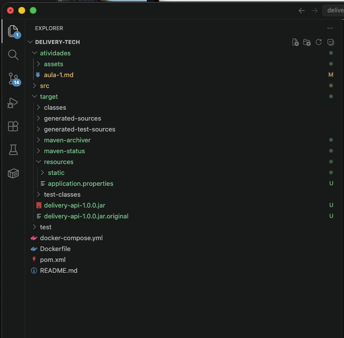

# Aula 1: Atividades e Entregáveis

## Atividade 1: Configuração do Ambiente

- Screenshot do terminal mostrando as versão do Java e Git

- Screenshot do VSCode com extensões do Java instaladas

---------------

## Atividade 2: Criação do Projeto Spring Boot
- [Arquivo ZIP do projeto baixado do Spring Initializr](./assets/delivery-api.zip)

- Screenshot da configuração no Spring Initializr (mostrando Java 21 selecionado)

----------------

## Atividade 3: Configuração do Repositório Git

- [URL do repositório GitHub público](https://github.com/thayllachristineo/delivery-tech)

- Screenshot mostrando commit inicial no GitHub

- Arquivo README.md básico criado
[README.md](../README.md)

---------------

## Atividade 4: Configuração da Aplicação

- [Arquivo application.properties configurado](../target/resources/application.properties)

- Screenshot da estrutura de pastas do projeto
